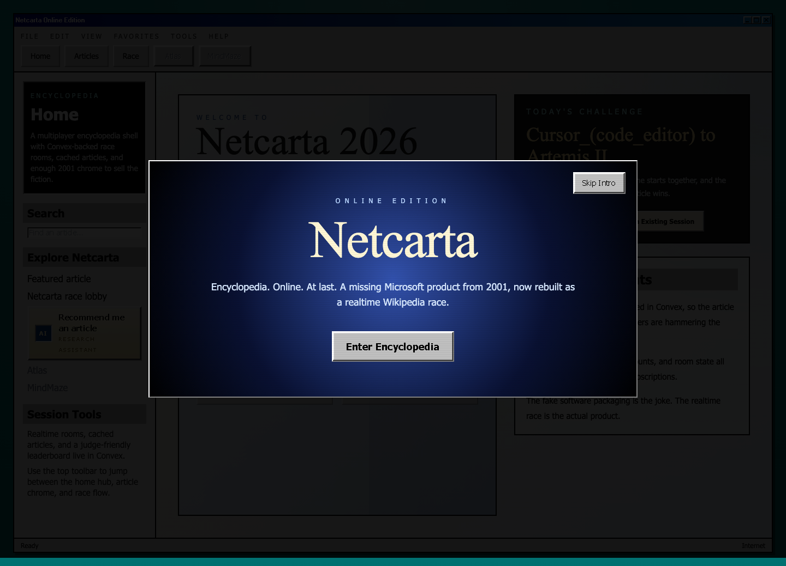
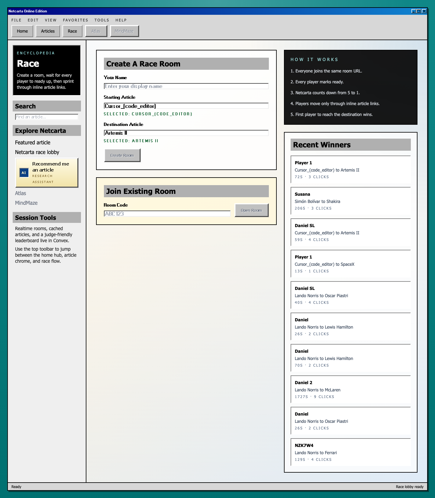

# Netcarta

Next.js app deployed on Cloudflare Workers via OpenNext, with Convex as the backend.

Built for the Frontier Tech Week Hackathon in Miami, April 2026.

## Screenshots

### Home



### Race Lobby



## Architecture

- Frontend: Next.js on Cloudflare Workers through OpenNext.
- Static assets: uploaded with the Worker and exposed through the `ASSETS` binding.
- AI recommendations: `/api/recommend-articles` calls Cloudflare Workers AI.
- Backend: Convex handles data, actions, queries, mutations, and realtime sync.

## Requirements

- Bun
- Node-compatible environment for Convex CLI
- Wrangler auth (`wrangler login`)
- Convex project URL and API key

## Local setup

1. Install dependencies:

```bash
bun install
```

2. Copy the env template and set values in `.env` or `.env.local`:

```bash
cp .env.example .env
```

3. Run the app:

```bash
bun run dev
```

> `NEXT_PUBLIC_CONVEX_URL` is required at build time for client-side Convex access.

> `CLOUDFLARE_ACCOUNT_ID` and `CLOUDFLARE_API_TOKEN` are required for the article recommendation dialog when you want Workers AI enabled locally.

## Deployments

### Frontend

Use OpenNext wrappers for Worker deploys:

```bash
bun run deploy
```

To test locally as a Worker:

```bash
bun run preview
```

### Backend

Deploy Convex separately:

```bash
CONVEX_DEPLOYMENT=little-deer-503 bunx convex deploy
```

## Cloudflare usage

This repo uses Cloudflare for:

- hosting the Next.js frontend as a Worker
- serving built static assets through the Worker deploy
- attaching the Worker to `netcarta.danielsaldarriaga.com`
- calling Workers AI from the recommendation API route

This repo does not use Cloudflare for the backend. Convex is the backend.

## Manual frontend release workaround

The current API token can upload a Worker version, but it cannot update Worker routes. When `bun run deploy` fails with an authentication error on `/workers/routes`, finish the release by promoting the uploaded Worker version manually:

```bash
bunx wrangler deployments status --env-file .env
bunx wrangler versions deploy --env-file .env --version-id "<version-id>" --percentage 100 -y
```

## Cloudflare token permissions

The deploy token needs at least:

- `Workers Scripts: Edit`
- `Workers Routes: Edit`
- `Zone: Read`

## Git-connected Cloudflare deploy checklist

When deployment is triggered from Cloudflare Git integration, environment variables are read from Cloudflare project settings, not local `.env` or `.env.local` files.

- Set plain env var: `NEXT_PUBLIC_CONVEX_URL`
- Set plain env var: `CLOUDFLARE_ACCOUNT_ID`
- Set plain env var: `CLOUDFLARE_AI_MODEL` (optional, defaults to `@cf/moonshotai/kimi-k2.6`)
- Set secret: `CONVEX_API_KEY` (or your preferred deployment-only secret)
- Set secret: `CLOUDFLARE_API_TOKEN`

If deploying manually with Wrangler and secret support is needed, use:

```bash
wrangler secret put CONVEX_API_KEY
wrangler secret put CLOUDFLARE_API_TOKEN
```

The recommendation feature validates every AI suggestion against Wikipedia before showing the links, and falls back to direct Wikipedia search results if Workers AI is unavailable.

## Notes

- `.env` is intentionally ignored in git and should only be local.
- `.dev.vars` is used for worker/development env defaults.
